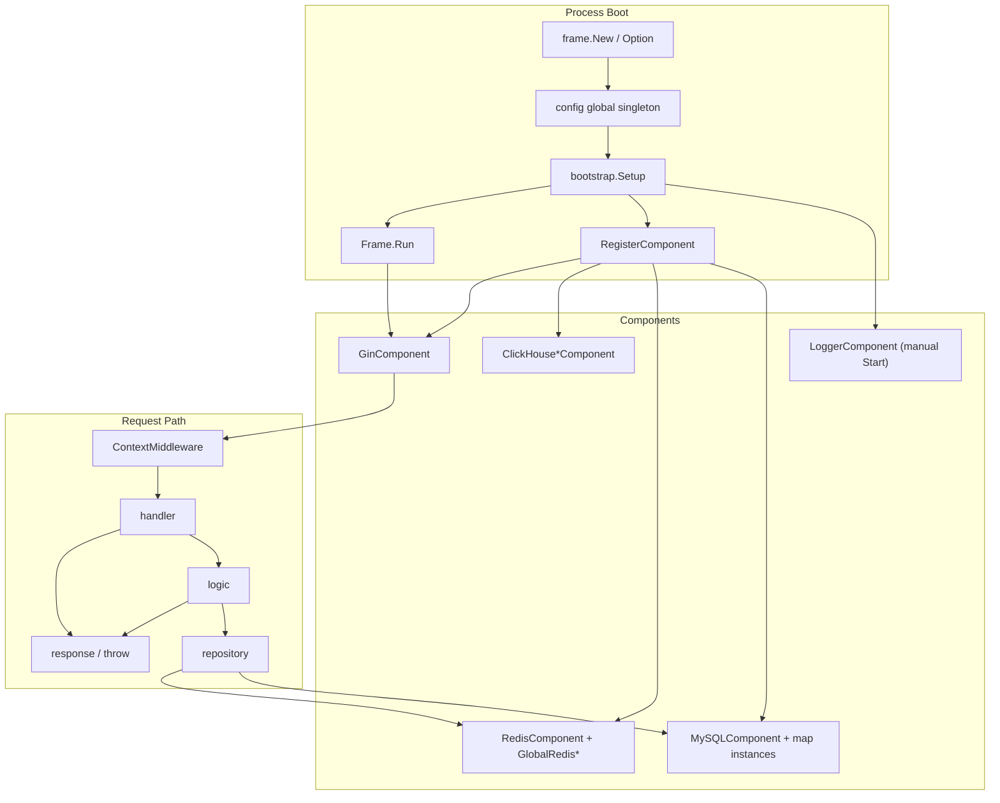

# go-frame-server 框架写法梳理与改进建议

> 目标：梳理本仓库自建框架的**既有写法**、**约定**与**不合理点**，并给出可执行的改进方案，作为后续架构改进的决策底稿。  
> 范围：仅本仓库（module: `github.com/boloc/go-frame-server`）。业务侧适配与对照另开文档。  
> 日期：2026-08-11（首版）/ 2026-08-12（补充生产环境常见补丁模式）/ 2026-08-13（明确"全新框架，不兼容旧写法"的重构前提）

---

## 0. 本次重构的前提（2026-08-13 起生效）

这不是一个有存量使用者、要小心翼翼做灰度迁移的框架，而是**按全新框架来推进的重构**：

1. **不做任何向后兼容处理**。发现旧写法不合理，直接改掉/删掉，不保留 `Deprecated` 包装、不留兼容别名、不写迁移期双轨代码。已经落地的例子：`pkg/throw`、`pkg/response` 曾经短暂标记过 `Deprecated` 并保留了实现，现在直接整包删除（确认过没有任何内部代码依赖它们之后）——发现问题就删，不是"发现问题就包一层"。
2. **但任何改动都必须严格考虑性能和并发正确性**，这条不因为"不用兼容"而放松，反而因为不用花精力做兼容层，更应该把省下来的精力用在这上面：
   - 新增/修改任何被请求路径调用的代码，先想清楚它是不是热路径、有没有不必要的分配、锁粒度对不对；
   - 涉及包级共享状态（哪怕只是一个 `bool` 开关）都要用 `atomic`/合适的同步原语，`go test -race` 必须过，不能因为"看起来不会并发写"就跳过；
   - 优化不是无限堆的：值不值得做一个更复杂的无锁实现，要看真实的读写比例（参考 `pkg/errs` 里 `atomic.Pointer` 换 `sync.RWMutex` 的取舍过程），不是"能优化就优化"。
3. 后续所有小节如果出现"为了兼容旧代码保留了 XXX"这种表述，视为待清理的技术债，不是既定结论。

---

## 1. 框架定位与现状

这是一个**轻量应用装配框架**，不是完整 Web 框架。核心能力：

| 能力 | 位置 | 说明 |
|------|------|------|
| 生命周期 | `pkg/frame/frame.go` | Component Start/Stop、AfterStart/BeforeStop、信号优雅退出 |
| 配置 | `pkg/frame/config` | Viper 封装 + 全局单例 |
| MySQL | `pkg/frame/components/mysql.go` | 主从、命名实例、全局访问 |
| Redis | `pkg/frame/components/redis*.go` | 单机/集群 + 全局指针 |
| ClickHouse | `pkg/frame/components/clickhouse*.go` | 原生 driver + GORM |
| Gin | `pkg/frame/components/gin.go` | HTTP 服务组件 |
| 日志 | `pkg/logger` | Zap + lumberjack，`LoggerComponent` 已接入标准 `frame.Component` 生命周期，便捷函数不会在 `Start()` 之前/`Stop()` 之后 panic |
| 错误/响应 | `pkg/errs` + `pkg/frame/webx`（`pkg/throw`/`pkg/response` 已整包删除） | 单一 `Error` 类型 + `errors.Is/As`，Caller 自动定位源头，默认打日志 |
| 请求校验 | `pkg/frame/validate` | struct tag + `Validatable` 接口，独立于 HTTP |
| 健康检查 | `pkg/frame/healthcheck` | 短 TTL 缓存 + 单项超时 + 标准 HTTP 状态码 |
| 连接池指标 | `pkg/frame/components/metrics.go` | MySQL/Redis 连接池的 `prometheus.Collector` |
| 请求上下文 | `pkg/frame/reqctx` + middleware | 把 query/body 塞进 `context.Context` |
| 分页 | `pkg/frame/pagination` | PageRequest / PageResponse / GORM Scope |
| 幂等保护 | `pkg/frame/idempotency` | 基于 Redis 的幂等中间件，按路由挂载，解决创建订单/支付类接口的重复提交问题 |
| 限流 | `pkg/frame/ratelimit` | 基于 Redis 固定窗口 + Lua 原子操作的限流中间件，按路由挂载 |
| 定时任务 | `pkg/frame/cron` | 基于 netresearch/go-cron 的 Component 化调度器，防并发重入 + 执行指标 + 优雅关闭 |
| 双层刷新只读缓存 | `pkg/frame/refreshcache` | 数据源→Redis→内存两层定时刷新，内部基于 `pkg/frame/cron` 调度，Go 泛型类型安全 API |
| 统一失败通知 | `pkg/alert` | 全局单 Hook，覆盖 HTTP 请求路径（`webx`）和后台/异步路径（`frame`/`gin`/`cron`/`idempotency`/`ratelimit`）的失败事件 |
| 数据库自动迁移 | `internal/migration`（示例应用层，非框架核心） | GORM AutoMigrate + 按命名实例分组的模型列表，`database.auto_migrate` 配置开关，默认关闭 |
| S3 兼容对象存储 | `pkg/frame/storage` | 基于 aws-sdk-go-v2，通用 S3Client + Cloudflare R2 便捷构造函数 |
| 其它 | `pkg/monitor`、`pkg/util` | 偏业务工具 |

设计主线可以概括为：

```text
Frame.New → 加载配置 → bootstrap 注册 Component → Run
  → Start(components) → AfterStart hooks → wait signal
  → BeforeStop hooks → Stop(components reverse)
```

应用侧通过**全局函数**拿依赖：

```go
frame.DefaultDB()
frame.GetRedis() / frame.GetRedisCmdable()
config.GetConfig()
logger.Info(...)
```

---

## 2. 官方推荐写法（example 体现的约定）

`cmd/example` 是框架自己给出的推荐姿势（这一节是 2026-08-13 按当前代码重新核对过的，之前几版文档写的是已经删除的 `throw.SqlException`/`frame.WithConfigFile` 那一套旧写法，不要再参考旧版本）：

```text
cmd/<service>/
├── main-demo.go            # 只做装配：解析配置 -> 加载配置 -> New -> Setup -> Hook -> Run
├── bootstrap/
│   ├── bootstrap.go        # Setup 总入口，conf 由 main 显式传入
│   ├── logger.go
│   ├── mysql.go
│   ├── redis.go            # 单机/集群/哨兵三选一
│   ├── clickhouse.go
│   └── gin.go
└── route/
    └── route.go            # 路由注册函数传给 GinComponent，含健康检查

internal/
├── <domain>/
│   ├── handler/            # 薄：Bind -> 校验层 -> 调 logic -> Success/Fail
│   ├── validation/         # 独立的业务规则校验层（不查库），handler 显式调用
│   ├── logic/              # 用例编排
│   ├── dto/                # 请求/响应 + 转换，不依赖 repository 包
│   └── repository/         # 数据访问，错误用 errs.Database/errs.Cache 包一层
└── model/                  # GORM 模型
```

### 2.1 启动链

```go
cfgPath := config.Resolve("./config/frame-server.yml") // -c > CONFIG_FILE 环境变量 > 默认值
conf, err := config.LoadFile(cfgPath)
if err != nil { ... }

f := frame.New(frame.WithShutdownTimeout(30 * time.Second)) // Frame 不再持有/加载配置
bootstrap.Setup(f, conf)
f.AfterStart(...)
f.BeforeStop(...)
f.Run()
```

### 2.2 HTTP 分层约定

| 层 | 职责 | 反例 |
|----|------|------|
| route | 挂路由、建 handler 实例 | 在 route 里写业务 |
| handler | Bind -> 校验层 -> 调 logic -> `webx.Success`/`webx.Fail` | 直接查库、拼复杂规则 |
| validation | 业务规则校验（不查库），handler 显式调用一次 | 放在 dto 里隐式触发 |
| logic | 编排 repo / 外部服务、DTO 转换 | 直接 `c.JSON` |
| repository | SQL/缓存访问，返回 model 或 `*errs.Error` | 返回 HTTP 语义错误码 |
| dto | 契约与 FromModel/ToCondition，不依赖 repository 包 | 直接把 model 吐给前端 |

example 里 repository 用 `db: frame.DefaultDB`（函数引用）而不是构造时缓存 `*gorm.DB`，相对更合理。完整示例见 `internal/example/handler/order_handler.go`。

### 2.3 错误约定

- 构造：`errs.New(code, msg)` / `errs.Wrap(code, err, msg)`，或语法糖 `errs.InvalidParams`/`errs.NotFound`/`errs.Database`/`errs.Cache`/`errs.Dependency`/`errs.Timeout`
- 业务自定义码：在自己的包里 `errs.RegisterHTTPStatus`/`errs.RegisterMessage` 登记一次（见 `internal/example/bizerr`）
- 出口：`webx.Success` / `webx.Fail`（默认永远 200，业务码放 body.code）/ `webx.FailWithStatus`（HTTP 状态码跟随 Code 语义，接口自己选）

统一响应体：

```json
{ "code": 0, "message": "success", "data": {}, "fields": {}, "caller": "..." }
```

`fields` 仅参数校验失败时非空；`caller` 仅 `webx.IncludeCallerInResponse=true`（默认 false）时非空——生产环境不应该把服务器文件路径暴露给客户端，默认只会出现在日志里（见 `pkg/frame/webx` 的 `logFailure`）。

---

## 3. 当前架构图（如实描述）



全局依赖是事实上的 IoC 容器：简单，但难测、难多实例、难做优雅替换。

> 以上是**重构前**（2026-08-13 之前）的架构快照，用来说明"问题出在哪"；`Cfg`（配置耦合进
> `Frame.New`）、`Resp`（`response`/`throw`）这两块目前都已经不是这样了，最新状态看第 4 章
> 每一条对应的"现状"说明和第 10 章结论，本图不再更新，只作为历史参照。

---

## 4. 不合理写法清单（按优先级）

### P0 — 设计债，后续改动收益最大

#### 4.1 全局单例 + panic 访问 —— 非 panic 变体已补齐，全局单例本身仍是遗留项

几乎所有基础设施都是 package-level 全局：

- `config.globalConfig` + `once.Do`
- `components.mysqlInstances` / `defaultMySQLDB`
- `components.GlobalRedisComponent` / `GlobalRedisClusterComponent`
- `logger.log`

访问失败直接 `panic`。后果：

- 单测必须"先启动半个框架"
- 同进程多服务/多配置几乎不可能
- 初始化顺序错误要到运行时才炸
- `MustLoadFile` 的 `once.Do` 会**静默忽略**第二次不同路径加载
- 任何在框架生命周期之外被调用的代码（后台协程、定时任务、健康检查、中间件里的兜底逻辑）都被迫自己包一层 `recover`，否则一次意外调用就能让整个进程崩掉

**现状**：给 MySQL/Redis 这两组最常用的全局访问器补齐了非 panic 变体（`TryXxx() (T, bool)`），panic 版本内部改成调用对应的 Try 版本，不是两套独立实现：

- MySQL：`components.TryDefaultMasterDB/TryDefaultSlaveDB/TryMasterDB/TrySlaveDB/TryGetMySQLComponent`，对应 `pkg/frame/mysql.go` 的 `frame.TryDefaultDB/TryDefaultSlaveDB/TryMasterDB/TrySlaveDB`。顺带修了一个数据竞争：旧版本 `DefaultMasterDB`/`DefaultSlaveDB` 直接读 `defaultMySQLDB` 这个包级变量，没有加锁，而写它的 `NewMySQLComponent` 是加锁的——现在 `TryDefaultMasterDB`/`TryDefaultSlaveDB` 统一在 `mysqlMu.RLock()` 下读取。
- Redis：`pkg/frame/redis.go` 的 `TryGetRedis/TryGetRedisCluster/TryGetRedisSentinel/TryGetRedisCmdable`。
- `pkg/frame/healthcheck` 的 `MySQLChecker`/`RedisChecker` 已经改成要求传 `(T, bool)` 语义的函数（例如 `frame.TryDefaultDB`），不再是"传 panic 语义的函数 + 内部 `recover` 兜底"，见 4.9——这也是这套 Try 模式发挥价值的第一个真实消费者。

**仍然是遗留项**：

1. `config`/`logger` 这两块全局单例本身（`config.globalConfig`、日志的全局访问方式）还没有对应的非 panic 变体或依赖图重构；`logger` 的便捷函数已经不会 panic（见 4.2），但这是"退化到兜底 logger"，跟"给一个 `TryXxx` 让调用方自己判断"是两种不同的解法，还没有统一。
2. Frame 持有依赖图、应用通过构造注入拿句柄（彻底告别全局访问）这个更大的方向仍未推进，见 Phase 2。

#### 4.2 Logger 不是真正的 Component —— ✅ 已修复

`SetupLogger` 手动 `log.Start()` + `f.SetLogger`，不走 `RegisterComponent`，也没有 Stop/flush 接入优雅退出。  
和 MySQL/Redis/Gin 的生命周期模型不一致。**这个问题的连锁反应**：任何"启动阶段就要用到日志"的组件（例如定时刷新缓存的后台协程）都不敢依赖框架 `logger`，因为 `log.Start()` 之前调用会 panic，只能自己接一个可选的错误回调。

**现状**：分两部分修复。

1. **连锁反应（便捷函数 panic）**：`pkg/logger/logger.go` 用 `atomic.Pointer[zap.Logger]` 存当前 logger，没 `Start()` 时退化到一个只写 stderr 的兜底 logger，不会 panic、也不会丢日志（见 `TestConvenienceFunctionsDoNotPanicBeforeStart`）。这意味着任何后台协程/健康检查/webx 的默认错误日志（见 4.5）现在都能放心直接调用 `logger.Xxx`，不需要再自己包一层判空或者接可选回调。
2. **`LoggerComponent` 本身接入标准生命周期**：`LoggerComponent.Start` 签名改成 `Start(ctx context.Context) error`，满足 `frame.Component`；新增 `Stop(ctx context.Context) error`，把缓冲区 `Sync()` 一次、再把包级 logger 退回兜底状态（`Stop` 之后还有代码往里写日志也不会 panic，只是退化到 stderr）。`SetupLogger` 现在只是 `f.RegisterComponent(log)`，不再手动 `log.Start()`。**必须是 `bootstrap.Setup` 里第一个注册的组件**：Frame 按注册顺序 `Start`、反序 `Stop`，Logger 第一个启动、最后一个关闭，这样其它组件 Start/Stop 报错时日志已经就位；即使不是第一个注册也不会 panic，只是 Logger 真正 `Start` 之前的日志会走兜底 logger。

顺带解决了一个隐藏的时机坑：`Frame` 自己的日志（`"frame started successfully"` 之类）以前要求业务在 bootstrap 阶段手动 `f.SetLogger(log.GetLogger())`，但那一刻 `LoggerComponent` 通常还没 `Start()`，拿到的是半初始化的 logger，之后也不会跟着真正 `Start()` 完成后自动更新——`f.SetLogger` API 已经整个删掉，`Frame` 的 `logInfo`/`logError` 直接调用 `pkg/logger` 的包级函数，天然享受"没 Start 就退化、Start 之后自动变成真正配置好的那个"的语义，不需要业务再手动接一次线。

#### 4.3 `frame.New` 里做 `flag.Parse`

```go
configFile := flag.String("c", f.config.ConfigFile, "配置文件路径")
flag.Parse()
```

问题：

- 污染全局 flag，和应用自己的 CLI 冲突
- 测试/多次 New 行为怪异
- 配置加载与 Frame 构造耦死

**改进方向**：把"解析配置路径"移到 `main` 或独立 `LoadConfig(opts)`；Frame 只接收已加载的 `*ConfigComponent`。

#### 4.4 配置 API 与文档不一致

| 来源 | API |
|------|-----|
| 当前源码 | `MustLoadFile(path)` |
| README / Option | `WithConfigFile` + 环境变量 `CONFIG_FILE` / `-c` |

源码路径只有一种加载入口，但入口藏在 `New` 内部，且与 Option、环境变量优先级交织，可读性差。历史上框架的配置加载 API 至少有过两代签名（"配置名 + 目录" 两参数版本、"完整文件路径" 一参数版本），如果消费方长期锁定旧版本不升级，说明这类 breaking change 的迁移成本被低估了。

**改进方向**：定一条主 API（建议 `config.LoadFile` 返回 error），其余标记 Deprecated；CHANGELOG 写清 breaking change，并给出从旧签名迁移的最小代码片段。

#### 4.5 错误体系偏 Java，调用栈魔法脆弱 —— ✅ 已修复（新增 `pkg/errs` + `pkg/frame/webx`，`pkg/throw`/`pkg/response` 已整包删除）

- 命名：`XxxException`、`ExceptionError`（Go 习惯是 `ErrXxx` / 哨兵错误 / `fmt.Errorf("%w")`）
- `runtime.Caller(3)` 固定 skip，包一层包装就会指错位置
- `ApiError` / `ApiCustomError` / `ValidationError` / `SqlError` / `ClientError` 类型膨胀，response 里巨型 type-switch
- 业务错误几乎一律 **HTTP 200 + 业务 code**，网关/监控难区分 4xx/5xx；如果这个决策要保留，就必须有另一条独立的可观测通道（例如按业务错误码单独打点），否则 HTTP 层的 status 指标会一直显示"零错误"，即使系统在大量返回业务失败

**现状**：新增了 `pkg/errs`（唯一的 `Error` 类型，支持 `errors.Is/As/Unwrap`）+ `pkg/frame/webx`（`Bind`/`Success`/`Fail`/`FailWithStatus`）。`pkg/throw`/`pkg/response` 短暂标记过 `// Deprecated` 之后确认没有任何内部代码依赖，直接整包删除——本次重构不做向后兼容（见第 0 章），没有存量使用者需要迁移期兼容，发现旧写法该淘汰就直接删，不留兼容包装。逐条对应改进方向的落地情况：

1. **稳定错误类型**：`errs.Error{Code, Message, Err, Fields, Caller}`，`Code` 是独立类型而不是裸 `int`；构造走 `errs.New/Wrap` 及一批语法糖（`InvalidParams`/`NotFound`/`Database`/...）。
2. **`errors.As` 替代 type-switch**：`webx.Fail` 内部就是 `errs.From(err)` 一次 `errors.As`，没有巨型 case。
3. **Caller 不再靠固定 `runtime.Caller(3)` 瞎猜**：`errs.captureCaller` 沿调用栈往上走、按包名前缀过滤，不管中间包了多少层语法糖函数都能精确定位到"业务代码里真正调用 errs 包的那一行"（`pkg/errs/errs_test.go` 的 `TestCallerPointsToActualCallSiteNotWrapperFunctions` 专门验证了这一点：`New`/`InvalidParams`/`Database`/`Newf`/`NotFound` 五种不同包装深度定位到的都是同一行业务代码）。构造一次错误的成本约 1μs（`BenchmarkCapturedCaller` 实测），这是错误路径而不是热路径，这笔开销划得来。
4. **HTTP 200 策略 + 可观测性 hook**：默认 `webx.Fail` 永远 200，个别接口需要真实状态码显式用 `webx.FailWithStatus`（不是全局开关，见 11.x 那一版讨论）；`webx.SetOnFail(func(route string, err *errs.Error))` 提供业务级观测钩子。**更关键的一点**：`webx.Fail`/`FailWithStatus` 现在**默认无条件打日志**（`respond` 内部的 `logFailure`），带上 `Code`/`Message`/`Caller`/`Err` 原始错误链/`route`/`method`，5xxxx 走 `Error` 级别、其它走 `Warn`——旧设计假设"日志中间件负责记录"，但框架从来没提供这层中间件，实际效果是报错了却没有任何地方留下线索。现在不需要额外接任何中间件，`webx.Fail` 自己就会记；本地开发还可以 `webx.IncludeCallerInResponse.Store(true)` 直接在响应体里看到 `caller` 字段，不用来回切日志窗口。
5. ~~**异步任务/后台协程失败的可观测性**~~ —— ✅ 已解决：新增 `pkg/alert`，一个全局单
   Hook（不是发布订阅式的多 Hook 列表，理由见包文档），`Notify` 内部另起 goroutine + 
   recover 调用业务注册的 Hook，且用 `context.WithoutCancel` 剥离取消信号，不会因为
   调用方的 ctx 被取消就让通知本身跟着失败。已经接入的位置：`pkg/frame/frame.go`
   （改 `logError` 一处，覆盖组件启停失败/钩子失败等 Frame 生命周期里的全部错误路径）、
   `pkg/frame/components/gin.go`（后台 `Serve()` 循环意外退出，顺手把这个文件里残留的
   stdlib `log`/`fmt.Println` 也统一改成了 `pkg/logger`）、`pkg/frame/cron`（任务失败/
   panic）、`pkg/frame/idempotency`/`pkg/frame/ratelimit`（Redis 降级发生时）、
   `pkg/frame/webx`（`respond` 内部，只对 `>= CodeInternal` 触发，不对常规的 4xxxx
   客户端错误触发，避免刷屏）。业务只需要在 bootstrap 阶段调用一次 `alert.SetHook(...)`
   （比如接飞书/企业微信 webhook），就能一次性覆盖 HTTP 请求路径和全部后台/异步路径的
   失败通知，不需要分别接好几套。

可以直接访问 `GET /test/error-source`（`cmd/example`）体验 Caller 定位效果，`internal/example/handler/capability_handler.go` 里故意包了两层普通函数调用来验证不会指错。

### P1 — 组件实现细节问题

#### 4.6 MySQL `NewMySQLComponent` + `sync.Once` 吞配置 —— ✅ 已修复

同名二次创建会忽略新 config，却仍返回旧实例，调用方毫无感知；`isDefault` 也只能"第一次生效"。

**现状**：`pkg/frame/components/mysql.go`（以及同款问题的 `clickhouse.go`/`clickhouse_gorm.go`）已经去掉了 `sync.Once` 那套"幂等创建"逻辑，同名重复注册直接 `panic`——这是启动阶段的编程错误，应该在启动时就炸出来，而不是悄悄让第二份配置形同虚设。同时补了两个相关的加固：

- 从库连接失败不再是致命错误：`Start()` 里跳过连不上的从库继续启动，`Slave()` 在没有健康从库时回落到主库，避免一个从库抖动拖垮整个服务的启动；
- 初始连接支持 `ConnectRetryAttempts`/`ConnectRetryInterval` 重试（默认 3 次、间隔 2s），缓解容器化部署里"App 容器比 DB 容器先启动"的竞态；额外补了 `ConnMaxIdleTime`（默认 10 分钟）避免连接在池里闲置太久被 MySQL 自己断开导致 "MySQL server has gone away"。

用真实 MariaDB 容器跑过集成测试（`pkg/frame/components/mysql_test.go` 的 `TestMySQLIntegration`）验证了以上三点。

**遗留的边界**：本组件不做"发现新主库地址"这件事——主从切换（MHA/Orchestrator 把某个从库提升为新主）应该交给基础设施层（VIP/ProxySQL/云厂商只读分离 endpoint）处理，`MasterDSN`/`SlavesDSN` 只要指向不变的逻辑地址，物理主库漂移对这一层是透明的；如果直接写物理 IP，主库漂移后仍然要靠改配置 + `SIGHUP`（`Frame.Restart`）重新连接。

#### 4.7 Redis 在 `New` 时写入全局，而不是 `Start` 成功后 —— ✅ 已修复

```go
GlobalRedisComponent = r  // NewRedisComponent 内
```

组件还未 Ping 成功就已成为全局可用入口；若 Start 失败，全局已脏。

**现状**：`GlobalRedisComponent`/`GlobalRedisClusterComponent`（以及新增的 `GlobalRedisSentinelComponent`，见下）现在只在 `Start()` 里 `Ping` 成功之后才发布，`Stop()` 会把全局指针清空并关闭客户端——避免 `Frame.Restart`（`SIGHUP` 热重启）期间有人拿到一个已经 `Close` 的 client。同时补了 `sync.RWMutex` 保护 `client` 字段（原来 `Start`/`Stop`/`GetClient` 并发调用时对 `client` 字段的读写完全没有同步，是一个真实的 data race）。用真实 Redis 容器跑过集成测试验证。

**这一版补的一个不一致**：MySQL 的 `Start()` 支持 `ConnectRetryAttempts`/`ConnectRetryInterval` 重试（见 4.6），但三种 Redis 组件之前 `Ping` 一次失败就直接报错，没有重试——容器化部署里 Redis 容器比 App 容器慢启动这类瞬时故障，MySQL 能扛过去，Redis 之前扛不过去，是真实的不一致。现在三种 Redis 组件（单机/集群/哨兵）都补上了同样语义的 `connectRetryAttempts`/`connectRetryInterval`（默认 3 次、间隔 2s，和 MySQL 保持一致），对应 `WithRedisConnectRetryAttempts`/`WithRedisConnectRetryInterval`（集群/哨兵同名前缀）。重试逻辑本身抽成了 `pkg/frame/components/connect_retry.go` 里的 `retryConnect`，MySQL 原来的重试代码也重构成调用它，不再各写一份几乎一样的重试循环。

**同一类不一致在 ClickHouse 这边也存在，一起修了**：`ClickHouseGORMComponent`（`gorm.io/driver/clickhouse`）本来就有 `ConnectRetryAttempts`/`ConnectRetryInterval`，但用的是自己手写的一份重试循环，没有复用 `retryConnect`；原生驱动的 `ClickHouseComponent`（`github.com/ClickHouse/clickhouse-go/v2`）干脆完全没有重试字段，`Start()` 只 `Open`+`Ping` 一次，连不上就直接报错——和 MySQL/Redis 比是最弱的一个。现在两者都统一了：`ClickHouseComponent` 补上了 `ConnectRetryAttempts`/`ConnectRetryInterval`（默认同样 3 次/2s）+ `WithClickHouseConnectRetryAttempts`/`WithClickHouseConnectRetryInterval`，`ClickHouseGORMComponent` 的重试循环也换成调用 `retryConnect`。到这里，MySQL/Redis（三种模式）/ClickHouse（两种驱动）在"启动时连接失败要不要重试、重试参数叫什么"这件事上已经完全一致，不需要再对着不同组件记不同的重试写法。

顺带确认了一下 `clickhouse-go/v2` 本身的 API 用法没有问题：`clickhouse.Open`/`Options`/`Auth`/`Compression`/`ParseDSN`/`driver.Conn` 都是 v2 才有的类型（v1 是走 `database/sql` 那一套注册驱动的旧接口），`go.mod` 里 `github.com/ClickHouse/clickhouse-go/v2 v2.48.0` 和代码实际用的 API 是对得上的，这次触发去重新核对纯粹是因为发现了重试这个真实缺口，不是 v2 本身有什么要迁移的地方。

**`gorm.io/driver/clickhouse` 本身也已经是基于 v2 的最新版（v0.7.0）**：翻了一下它的源码（`gorm.io/driver/clickhouse@v0.7.0/clickhouse.go`），`import "github.com/ClickHouse/clickhouse-go/v2"` 已经写在那里了，走的是 `sql.Open("clickhouse", dsn)` 这套 `database/sql` 标准接口（clickhouse-go/v2 自己会把驱动注册成标准库认识的 `"clickhouse"` driver name），没有停留在 v1。所以"要不要把这个驱动升级到 v2"这个问题的答案是：它已经是了，不需要升版本。

**但顺着这个问题去找更贴合 v2 的写法，确实找到了一处能优化的地方**：v2 提供了 `clickhouse.OpenDB(*clickhouse.Options) *sql.DB`，可以直接用一份结构化的 `Options` 拿到 `*sql.DB`，不需要先手动拼一个 DSN 字符串、再让驱动内部通过 `sql.Open` 重新解析一遍字符串。旧版本 `ClickHouseGORMComponent` 只接受 `DSN string`，逼着调用方（`cmd/example/bootstrap/clickhouse.go`）先用 `util.BuildClickhouseDSN` 拼一个 DSN，绕了一圈。现在：

1. 新增 `pkg/frame/components/clickhouse_options.go`：`clickhouseConnParams`（结构化连接参数，字段名和原生驱动 `ClickHouseConfig` 完全一致）+ `buildClickHouseOptions`，把"DSN 优先，否则按结构化字段拼 `*clickhouse.Options`"这份逻辑抽出来一次写好，`ClickHouseComponent`（原生驱动）和 `ClickHouseGORMComponent`（GORM 驱动）两边共用，不再各写一份几乎一样的分支代码。
2. `ClickHouseGORMConfig` 加上了和原生驱动同名的结构化字段（`Address`/`Database`/`Username`/`Password`/`Protocol`/`DialTimeout`/`ReadTimeout`/`Compression`），`DSN` 仍然保留作为可选的"直接给一个现成字符串"逃生舱口，不强制迁移。
3. `connect()` 改成 `chgo.OpenDB(options)` 拿到 `*sql.DB`，设置好连接池参数、`PingContext` 确认连通之后，用 `gormclickhouse.New(gormclickhouse.Config{Conn: sqlDB})` 直接把这个现成的 `*sql.DB` 交给 GORM，不再让 GORM 驱动内部重新走一遍 DSN 解析。
4. 顺手修了一个"配置项形同虚设"的问题：`config/frame-server.yml` 里 `clickhouse.default_ch.dial_timeout`/`read_timeout` 一直都写在配置文件里，但旧版本 `cmd/example/bootstrap/clickhouse.go` 的 `ClickHouseConfig` 结构体压根没有这两个字段，写了完全没用。现在这两个 key 会被解析并透传给 `Options.DialTimeout`/`ReadTimeout`。
5. 补齐了 `TryDefaultClickHouseDB`/`TryClickHouseDB`/`TryGetClickHouseGORMComponent`（面板 panic 版本内部调用 Try 版本，不 panic 的 Try 版本），和 MySQL/Redis 已经有的非 panic 访问器（见 4.1）保持一致——之前 ClickHouse 这块是唯一没有 Try 变体的存储组件。

新增了 `pkg/frame/components/clickhouse_options_test.go`/`clickhouse_gorm_test.go`，覆盖 `buildClickHouseOptions` 的几种分支（DSN 优先、协议默认值、非法 DSN 报错）和 `ClickHouseGORMComponent` 的重试/panic 行为。

**新增 `RedisSentinelComponent`**（`pkg/frame/components/redis_sentinel.go`）：单机 Redis 如果需要客户端可感知的主库故障转移（哨兵检测到主库挂了、选出新主库后，客户端下次取连接自动拿到新地址，业务代码不用重启、不用感知），应该接 Sentinel，而不是自己写重连逻辑。三种 Redis 部署形态在"主从切换"这件事上的分工：

| 模式 | 故障转移谁来做 | 客户端要不要感知 |
|---|---|---|
| 单机 | 外部 VIP/代理把流量切到新主库 | 不需要，前提是地址不变 |
| Cluster | 协议内置（MOVED/ASK 重定向） | 不需要，go-redis 自动跟随 |
| Sentinel | 哨兵选主 + go-redis 自动重连 | 不需要 |

`GetRedisCmdable()` 的优先级也更新为 集群 > 哨兵 > 单机（`pkg/frame/redis.go`）。

#### 4.8 Gin `SetTrustedProxies([]string{"0.0.0.0/0"})` —— ✅ 已修复

等于信任所有代理，`ClientIP()` 可被伪造，公网服务存在客户端 IP 伪造风险。应默认改成 `nil`（不解析任何 forwarded header），只有明确配置了网关 CIDR 时才信任。

同时，框架创建的 `http.Server` 没有设置 `ReadTimeout/ReadHeaderTimeout/WriteTimeout/IdleTimeout/MaxHeaderBytes`——公网入口存在 slowloris / 慢请求占满连接句柄的风险（这也是 `go vet` G112 规则会报警的点）。这是一个安全默认值问题，不应该要求每个消费者都自己重新发明一次超时配置。

**现状**：`GinComponent` 已经内置了保守的超时默认值（`ReadHeaderTimeout=10s`、`ReadTimeout/WriteTimeout=30s`、`IdleTimeout=60s`、`MaxHeaderBytes=1MB`），`TrustedProxies` 默认 `nil`，都做成了可覆盖的 `WithGinXxx` Option。另外加了两处提醒（不改默认值，只是让"忘配置"这件事不再完全静默）：启动时如果 `TrustedProxies` 是默认值会打一行提示；运行时如果收到带 `X-Forwarded-For`/`X-Real-IP` 的请求但没配置信任来源，会警告一次（不逐请求刷屏）。见 `pkg/frame/components/gin.go` 和对应测试。

#### 4.9 Gin Start 异步 Listen 错误只打 log / 框架没有内置健康检查 —— ✅ 已修复

`ListenAndServe` 失败不会让 `Frame.Start` 失败退出（除非后续加健康检查）。进程可能"假活"。

框架也没有内置 `/health`。一个可用的健康检查至少要做到：（1）结果做短 TTL 缓存，避免探活频率高时把 Ping 流量打满数据库；（2）每个依赖单独设超时，避免探活本身卡死；（3）健康与否映射到标准 HTTP 状态码（如 503），方便接入 blackbox_exporter / K8s liveness。

**现状**：

1. **健康检查**：新增 `pkg/frame/healthcheck`，`Handler(deps []Dependency, opts ...func(*Options))` 满足以上三点：默认结果缓存 10s（`WithCacheTTL` 可调）、每个依赖默认 1s 超时（`WithPerCheckTimeout` 可调）、健康时 200/不健康时 503。`Dependency.Critical` 控制"这个依赖挂了要不要影响整体健康状态"（旁路缓存挂了不该让 K8s 判定整个 Pod 死掉）。`cmd/example` 的 `/health` 已经接上真实的 MySQL/Redis 检查（原来只是返回 `{"message":"ok"}` 的摆设）。`MySQLChecker`/`RedisChecker` 现在要求传 `(T, bool)` 语义的访问函数（`frame.TryDefaultDB`/`frame.TryGetRedisCmdable`，见 4.1），不再是 panic 语义 + `recover` 兜底——类型上就杜绝了"健康检查被一个不该发生在这里的 panic 拖崩"的可能性，不需要再靠运行时 `recover` 去补救。
2. **Listen 失败会让 Start 失败退出**：`GinComponent.Start` 把 `net.Listen` 从 `ListenAndServe` 里拆出来，同步执行——端口被占用/权限不足这类绑定失败会立刻从 `Start()` 返回 error，`Frame.Start` 会据此回滚已启动的组件，不会再出现"进程看起来在跑，但压根没监听端口，只能靠外部探活才能发现"的假活状态。绑定成功之后剩下的 `Serve(ln)` 循环本身没有"成功/失败"的中间状态，仍然放在后台 goroutine 里，只在真正的意外错误（不是 `Stop` 触发的 `http.ErrServerClosed`）时打日志。

#### 4.10 Context 中间件过重且包名拼写错误 —— 改名和空指针问题已修复，其余仍是遗留项

- 包名 `content` 应为 `context`（或 `reqctx`），长期误导
- 每个请求 `GetRawData` 读完整 body，大上传/文件接口有内存风险，且框架本身不限制请求体大小，公网服务需要自行补一层 `http.MaxBytesReader`
- 用 `*datatypes.JSON` 存 query/body，语义奇怪（GORM 类型渗入 HTTP 层）
- `FromContext` 找不到时返回 `nil`，`FromGin` 却立刻解引用，有空指针风险
- 除了请求体大小限制外，公网服务通常还需要一层"业务 handler 卡 DB/Redis 死循环"时的兜底：给整个请求挂 `context.WithTimeout`，这样 handler/logic 里基于该 ctx 的下游调用都会跟着取消。这类中间件对注册顺序高度敏感（例如"限制 body 大小"必须在 `ContextMiddleware` 读 body 之前生效），顺序错了不会报错，只会"悄悄失效"

本次重构不保留兼容别名包（见第 0 章）：`pkg/frame/content` 已经整包删除，不是标记 Deprecated 之后再删。

**现状**：

1. **改名 + 类型清理**：`pkg/frame/content` → `pkg/frame/reqctx`。顺手把 `RequestQuery`/`RequestBody` 的类型从 `*datatypes.JSON` 改成了 `[]byte`——GORM 的类型没有理由渗入到"HTTP 请求上下文"这个和数据库完全无关的包里，`[]byte` 才是这两个字段真实的语义（一段原始字节，不是"一个 GORM 认识的 JSON 列"）。
2. **空指针 bug 已修复**：`FromContext` 找不到时不再返回 `nil`，改成返回一个全新的空 `*RequestContext`；`FromGin` 因此不会再对着 `nil` 解引用 panic。这是一个真实的历史 bug——任何没经过 `ContextMiddleware` 的路由（比如手写的 `pprof`/`debug` 路由）一旦调用 `FromGin` 就会直接崩，`pkg/frame/reqctx/context_test.go` 的 `TestFromGinNeverPanicsWithoutMiddleware` 专门覆盖了这个场景。

**这一版新增（✅ 已实现）**：

1. **`WithGinMaxBodyBytes`（默认 4MB）**：`pkg/frame/middleware/body_limit.go` 新增 `MaxBodyBytes(n int64) gin.HandlerFunc`，用 `http.MaxBytesReader` 包一层 `c.Request.Body`；`GinComponent` 默认开启（4MB），并保证在 `NewGinComponent` 内部先于业务自己 `Use()` 的任何中间件注册（尤其是会读整包 body 的 `ContextMiddleware`），顺序问题不需要业务自己操心。
2. **`WithGinRequestTimeout`（默认 0，不启用）**：`pkg/frame/middleware/request_timeout.go` 新增 `RequestTimeout(d time.Duration) gin.HandlerFunc`，给 `c.Request.Context()` 挂 `context.WithTimeout`。不默认开启：不同接口对"多久算超时"预期差异很大（报表生成之类天然需要几十秒），强加全局默认值容易误伤正常慢接口；生效前提是 handler/logic/repository 把 ctx 一路传给下游调用，框架只负责让 ctx 按时取消，不会主动中断 handler。
3. **修了一个"限制形同虚设"的 bug**：`ContextMiddleware` 之前对 `GetRawData()` 的 error 直接忽略（`body, _ := c.GetRawData()`），即使配了 `MaxBodyBytes`，超限请求也只是读到一个截断的空 body 继续往下跑，客户端完全感知不到"body 太大"。现在读 body 失败会直接 `webx.FailWithStatus(errs.RequestTooLarge(...))` 返回 413 并中断请求（新增 `errs.CodeRequestTooLarge`/`errs.RequestTooLarge`）。

**仍然是遗留项，还没有实现**：

1. 文档里"推荐中间件顺序 + 为什么"的独立说明清单、`ContextMiddleware` 检测 body 是否已经被读过一部分并告警——都还没做（前者已经在 `MaxBodyBytes`/`ContextMiddleware`/`GinComponent` 的代码注释里各自写了一部分，还没汇总成一份独立的清单）。

#### 4.11 Repository / DI 风格偏隐式 —— 走过一轮构造注入，最终按 nav-market-c 的真实写法定了下来

这一条的结论反复过一次，记录下来是为了不再来回摇摆：

**第一版问题**：example 里曾经同时存在两种矛盾的装配风格——`SystemConfigRepository` 走构造注入（`NewSystemConfigRepository(getDB)`），`ProductRepository`/`OrderRepository` 全链路却是零参数构造函数、内部自己 `New` 下一层依赖（`NewProductHandler()` 内部 `logic.NewProductLogic()`，后者内部又 `repository.NewProductRepository()`）。同一个例子里出现两种风格，肯定要统一。

**第二版："全面改成构造注入"**：把 `Product`/`Order` 两条链也改成构造注入，`route.go` 里逐层 `repository.NewX(db)` -> `logic.NewX(repo)` -> `handler.NewX(logic)`，`RegisterRoutes` 因此变成一个几十行、掺杂各种装配细节的大函数——即使后来拆成了 `registerProductRoutes`/`registerOrderRoutes` 等小函数，本质问题还是没解决：**这比 `nav-market-c` 真实生产代码复杂得多**。去翻 `nav-market-c` 的 `cmd/admin/route/route.go` 会发现它的路由注册就是 `admin.POST("/login", handler.Login)` 这种一行一个，`handler.Login` 是裸函数（不是结构体方法），函数体内部直接 `logic.NewLoginLogic().Login(...)` 现场 new，不做任何构造注入，`route.go` 里完全没有依赖装配代码。

**构造注入的真实代价**：不是"看起来复杂"这种模糊的感觉，是**每加一个依赖，要同时改两个地方**——handler 的构造函数签名，和 `route.go` 里的装配代码。这和"写代码应该循序渐进：不需要在写第一行路由的时候就想清楚完整的依赖链"这条开发体验直接冲突。`nav-market-c` 的风格加依赖只需要改一个地方（handler 函数体本身），这是它更简单的根本原因，不是"偷懒"。

**最终结论（✅ 已落地）**：改回 `nav-market-c` 的真实写法——handler 是包级函数，不是结构体方法；需要 logic/repository 时在函数体里现场 `New`；`route.go` 的 `RegisterRoutes` 重新变成一份"路径 -> 处理函数"的清单：

```go
// cmd/example/route/route.go——现在的样子
r.GET("/api/products", handler.ProductList)
r.POST("/api/orders", handler.OrderCreate)
r.GET("/api/system-configs/:key", handler.SystemConfigGetByKey)

// internal/example/handler/product_handler.go——现场 new，不做构造注入
func ProductList(c *gin.Context) {
    ...
    pageData, err := logic.NewProductLogic().GetList(&req)
    ...
}
```

这个写法对"现场 new 有没有代价"这件事的判断是：`logic`/`repository` 在这个框架里通常是**无状态的薄封装**（真正的状态活在数据库/Redis 里，或者像 `OrderRepository` 这种纯内存模拟实现里的一个进程内单例），构造一次的成本是一次结构体分配，可以忽略；构造注入换来的"可测试性/可随时替换成 mock"收益，在这种薄封装场景下并不明显——`nav-market-c` 跑在生产环境这么久没有暴露出问题，就是这个判断成立的证据。

**`OrderRepository` 的特例**：这是唯一一个真的持有状态（库存 map、订单 map）的 repository，如果照抄"现场 new"会导致每次请求拿到一张全新的空库存表——所以它改成了进程内单例（`repository.DefaultOrderRepository()`），`logic.NewOrderLogic()` 内部拿这个单例，而不是自己 new 一个新的。这不是对"现场 new"原则的违反，而是提醒：**这条原则的前提是"repository 本身不持有需要跨请求保留的状态"**，一旦不满足这个前提（比如这个纯内存模拟的例子，换成真实数据库之后这个顾虑就不存在了），该用单例就用单例。

**`config_db` 这种命名实例怎么在现场 new 的写法里访问**：`SystemConfigRepository` 内部直接调 `frame.TrySlaveDB(constant.MySQLConfigDB)`（全局访问器，见 4.1），不需要任何构造参数：

```go
func NewSystemConfigRepository() *SystemConfigRepository {
    return &SystemConfigRepository{
        db: func() *gorm.DB {
            db, _ := frame.TrySlaveDB(constant.MySQLConfigDB)
            return db
        },
    }
}
```

**中间件怎么配**：这条原则只解决"业务对象怎么装配"，跟中间件是两件事——中间件该挂在哪一层，看它的作用范围：整个进程都要跑的（`ContextMiddleware`、请求体大小限制）挂在 `GinComponent` 的全局中间件（`ginComponent.Use(...)`，见 `bootstrap/gin.go`）；只影响某一组路由的（登录校验、操作日志，对应 `nav-market-c` 的 `adminAuth.Use(middleware.AuthMiddleware(), middleware.OperationLogMiddleware())`），挂在对应的 `router.Group(...).Use(...)` 上，不影响其它分组。这个示例项目新增了 `internal/example/middleware/demo_token.go`（`RequireDemoToken`，检查一个演示用的请求头）作为分组级中间件的最小可跑示例，挂在 `/test` 这个分组上（见 `route.go`），不影响 `/api/*`、`/health`、`/metrics`。

**这条边界值得记住**：`pkg/frame/middleware`（跟框架一起发布，比如 `ContextMiddleware`）和 `internal/example/middleware`（这个应用自己的业务中间件，比如 `RequireDemoToken`）是两个不同的包——前者是框架能力，后者是业务规则，不应该混在一起，这跟 4.1/2 提到的"常量该放 `pkg/` 还是 `internal/`"是同一类边界判断。

**多命名 MySQL 实例的构造注入演示（✅ 已实现）**：`cmd/example` 现在同时跑了三个独立命名的 MySQL 实例——`default_db`（主业务库）、`config_db`（系统配置库）、`log_db`（审计日志库），演示"一个进程多个数据库边界"该怎么写、怎么测、怎么监控：

- **`cmd/example/bootstrap/mysql.go`**：新增 `SetupNamedMySQL(f, conf, name)`，和 `SetupMySQL`（default_db）共用同一份配置解析逻辑（`buildMySQLComponent`），只是不设为默认实例。三个组件都通过 `f.RegisterComponent` 纳入标准生命周期——任何一个 `Start()` 失败（比如 `config_db` 连不上），整个进程都启动不起来，不会出现"业务库连上了、`config_db` 却悄悄没连上"的半启动状态。
- **构造注入 + 真实业务功能**：`internal/example/repository/system_config_repository.go` 的 `SystemConfigRepository.GetValue` 是一个真实的业务方法（按 key 读一条系统配置，`model.SystemConfig` 是一张简单的 key-value 表），不是单纯为了演示连通性的空壳；`internal/example/handler/system_config_handler.go` 的 `SystemConfigHandler` 又构造注入这个 repository。真实业务接口 `GET /api/system-configs/:key` 可以直接体验。

  **组件注册和 repository 构造是两件独立的决定，也应该发生在两个不同的地方**：`bootstrap.go` 的 `SetupNamedMySQL(f, conf, "config_db")` 决定"这个连接要不要被 Frame 管生命周期"（只要打算用就该在启动阶段做）；`repository.NewSystemConfigRepository(...)` 决定"业务代码现在要不要用它"，这是业务对象的构造，应该放在 `route.go` 的 `RegisterRoutes` 里，跟 `ProductRepository`/`OrderRepository` 用同一个地方、同一种写法——`bootstrap.Setup` 的职责始终只是"初始化所有组件"，不应该混进任何业务对象的构造（这是曾经出现过的一个真实问题：`SystemConfigRepository` 一度被错误地放进了 `bootstrap.Setup`，又通过 `SetupGin` 一路传参穿透到 `route.go`，跟 Product/Order 的构造位置不一致，后来纠正为 `bootstrap.go` 只往下传 `configDBComponent.Slave` 这个方法值，真正的 `repository.NewSystemConfigRepository(...)` 调用挪到了 `route.go` 里）。没有具体业务需求时就不用写这行 repository 构造，没有需求就不写、等有了再加，不需要为了"看起来完整"而提前占位一个没有调用者的 repository（对照 `log_db`：它只注册了组件，没有对应的业务 handler，这不是偷懒，是因为目前没有业务代码需要直接查它）。
- **字符串注册表作为对照**：`log_db` 故意没有配对应的业务 handler，只在 bootstrap 里注册、只被健康检查/指标采集通过 `components.TryMasterDB("log_db")` 按名字访问（见 `cmd/example/route/route.go`）——这不是偷懒，是更贴近真实场景：日志库通常被通用的审计中间件写入，不会被具体某个业务 handler 直接依赖，构造注入反而找不到"该注入给谁"。构造注入和字符串注册表不是互斥的两个方案，有没有自然的消费者决定用哪个。
- **健康检查/指标按实例拆开**：`/health` 给 `default_db`/`config_db`/`redis` 标 `Critical: true`（任一个连不上整体 503），`log_db` 标 `Critical: false`（挂了不该让 K8s 判死重启）；`SetupMonitor` 改成接收 `map[string]*components.MySQLComponent`，给每个命名实例单独注册一份 `NewMySQLPoolCollector`，`GET /metrics` 能看到三个实例的连接池指标分别打了不同的 `instance` 标签，不会互相覆盖。
- **连接池预算提醒**：三个 `MySQLComponent` 的连接池是完全独立算的，如果它们其实是同一个物理 MySQL 实例下的不同 database，总连接数是几个 `MaxOpenConns` 加起来，需要确认服务端 `max_connections` 撑得住；`config_db`/`log_db` 在示例配置里给了比 `default_db` 更小的 `max_open_conns`（20 而不是 100），配置/日志类库的读写压力通常远小于主业务库。
- **实例名字集中定义（✅ 已修复）**：`"default_db"`/`"config_db"`/`"log_db"` 这几个字符串一开始是 `cmd/example/bootstrap` 和 `cmd/example/route` 两个包各自手写的，同一个名字在两处各写一遍，没有编译期保护，容易打错却要到运行时（健康检查/指标对不上号）才会发现。现在集中定义到 `internal/example/constant/mysql.go`（`MySQLDefaultDB`/`MySQLConfigDB`/`MySQLLogDB`），两个包都改成引用这几个常量。放在 `internal/` 下而不是 `pkg/`：这是这个示例应用自己的部署拓扑知识（"这个应用具体有哪几个命名 MySQL 实例"），不是框架该知道的东西，`internal/` 能让 Go 编译器强制保证框架的外部使用者永远拿不到它——这也是"框架级常量放 `pkg/constant`，应用级/业务级常量放 `internal/<app>/constant`"这条边界（见第 2 章）的又一个实例。

**从库读写分离演示（✅ 已实现）**：`database.default_db.slaves` 在示例配置里给了一个真实的从库条目（为了不依赖一台真实存在的第二台 MySQL，指向的是和主库相同的 `host:port`，注释里写清楚了这一点，纯粹是为了跑通配置解析→连接→读从库这条完整链路，生产环境要换成真正独立的只读副本地址）。`ProductRepository`（`internal/example/repository/product_repository.go`）是这个示例里唯一的纯读 repository，现在改成 `db: frame.DefaultSlaveDB`（原来是 `frame.DefaultDB`）——`DefaultSlaveDB`/`Slave()` 没配从库时会自动回落到主库（见 4.6），所以这个改动是没有下行风险的：不配从库时行为和读主库完全一样，配了从库之后自动获得分摊读压力的收益，不需要再改一次业务代码。原则很直接：**只读的 repository 默认应该读从库，会写数据的 repository 必须读主库**（从库允许有主从复制延迟，写完立刻读从库有读到旧数据的风险，这个示例里没有写方法，但注释里写清楚了这条边界）。

**从库不是 default_db 独有的能力**：`buildMySQLComponent`（`cmd/example/bootstrap/mysql.go`）对 `database.<name>` 任何一段都是同一份解析逻辑，`SetupNamedMySQL` 创建的命名实例（`config_db`/`log_db`）想要从库，直接在对应的 `database.config_db.slaves` 加一段就行，不需要改一行 Go 代码——示例配置里 `config_db` 现在也配了一个从库（`SystemConfigRepository.Ping` 相应地也改成读 `configDBComponent.Slave`），`log_db` 故意留成主库单一实例（日志库通常写多读少，业务代码几乎不会反过来查它，用主库单独扛读写压力足够，真的需要一样可以照做）。这组对比（`default_db`/`config_db` 配了从库，`log_db` 没配）就是用来证明"每个命名实例的从库配置完全独立、按各自需要决定"这件事，不是理论上"应该能做到"，是配置文件+代码里真的这么跑的。

### P2 — 边界与工程化

#### 4.12 框架包边界过宽

当前 `pkg/` 混有：

- 真正的框架核心：`frame`、`logger`（部分）
- Web 约定：`response`、`throw`
- 偏业务工具：R2 client、maps builder、PrintReqParams、RandomTTL
- example 演示代码：`internal/example`、`internal/model/product.go`

库消费者会被迫依赖一堆用不到的间接依赖（AWS SDK、ClickHouse、Prometheus…）。

**改进方向**：拆 module 或至少划清：

```text
frame-core      # Frame + config + component 接口
frame-mysql / frame-redis / frame-gin  # 可选组件
frame-http      # response / errors / pagination / reqctx
# 业务向工具移出核心，或放 examples/tools
```

**模块拆分本身仍然是遗留项**——量比较大（涉及 go.mod 拆分、CI、版本号策略），本次没有动。

**连接池 Prometheus Collector —— ✅ 已实现**：MySQL/Redis 组件持有 `*gorm.DB` / `*redis.Client`，但之前没有任何 Prometheus 采集器——连接池打满（`WaitCount`/`Timeouts` 飙升）是线上最常见的隐性故障之一，出问题时排查全靠猜。现在 `pkg/frame/components/metrics.go` 提供了两个采集器构造函数：

- `NewMySQLPoolCollector(instance string, m *MySQLComponent) prometheus.Collector`：采集主库 + 每个从库的 `database/sql.DBStats`（`MaxOpenConnections`/`OpenConnections`/`InUse`/`Idle`/`WaitCount`/`WaitDuration`/`MaxIdleClosed`/`MaxIdleTimeClosed`/`MaxLifetimeClosed`），打 `instance`/`role`（`master`/`slave`）/`index`（从库下标）三个标签。
- `NewRedisPoolCollector(instance string, provider redisPoolStatsProvider) prometheus.Collector`：采集 go-redis 的 `PoolStats`（`Hits`/`Misses`/`Timeouts`/`TotalConns`/`IdleConns`/`StaleConns`），打 `instance` 标签；`RedisComponent`/`RedisClusterComponent`/`RedisSentinelComponent` 三种模式都实现了同一个 `PoolStats()` 方法，一个 collector 类型就能覆盖三种部署形态，不需要各写一份几乎一样的代码。

两个采集器都是显式创建 + 显式 `prometheus.MustRegister`（不是在组件 `Start()` 里自动注册），一个进程里同一种组件有多个命名实例时（比如 `default_db` 和 `report_db`），每个实例都要单独注册一次、自己起名字，天然规避了"两个 Collector Desc 完全相同导致重复注册 panic"的问题。组件还没 `Start()`（或者已经 `Stop()`）时，`Collect()` 不会 panic，只是这一轮不产出任何指标（Prometheus 允许这样）。`cmd/example` 通过 `bootstrap.SetupMonitor` 把这两个采集器接到了默认的 MySQL/Redis 实例上，`GET /metrics` 可以直接看到效果（如果配置了 `prometheus.password` 会多一层 Basic Auth）。

**顺带修的一个例子**：`pkg/monitor`（"偏业务工具，边界模糊"的典型代表）原来在 `init()` 里无条件启动一个永远不会退出的后台协程采集内存/goroutine 指标，还带一句调试用的 `fmt.Println` 每 5 秒刷屏——只要 `import` 这个包就会触发，`Frame.Stop` 完全管不到它。现在改成了 `MetricsComponent`（`Start`/`Stop` 正常接入 Component 生命周期，`Stop` 会等后台协程真正退出）；`PrometheusAuth` 也不再隐式依赖 `config.GetConfig()` 全局单例，密码改成显式参数传入。这只是把这一个包从"能用但有隐患"修成"符合框架惯例"，`pkg/monitor` 本身要不要继续留在框架核心（而不是拆成独立的可选组件）这个边界问题还没解决。

#### 4.13 example 与 README 分层命名冲突

- README：`handler / service / repository`
- example：`handler / logic / repository`

应统一术语。建议：`logic` = 用例编排；若需要跨领域复用再引入 `service`，并在 README/example 同步。

#### 4.14 几乎无框架级单测

`tests/` 只有 maps 工具测试。Component 生命周期、配置优先级、优雅关闭、错误映射均无回归网。

#### 4.15 DTO 依赖 repository 包

example 的 `ProductListReq.ToSearchCondition` 返回 `repository.ProductSearchCondition`，导致 dto → repository 依赖。  
条件结构应放在更中性的位置（logic 私有、或独立 query 结构），避免环依赖隐患。

#### 4.16 其它小问题速记

- ~~`enum.FOUNT` 拼写错误（Found）~~ —— ✅ 已解决：这个类型属于 `pkg/throw/enum`，随 `pkg/throw` 整包删除（见 4.5）一起没了，不存在"改名"的问题。
- ~~`GetConfigValue` 用反射式 switch，失败只 log 返回默认值，易静默出错~~ —— ✅ 已解决：直接删掉了这个函数。它在整个代码库里没有任何调用方（纯遗留死代码），而它本身的实现问题也不是"改一下就能修好"的量级——反射式 `switch any(defaultValue).(type)` 支持的类型列表天然不完整，落到 `default` 分支只会 `log.Printf` 然后返回默认值，业务代码完全无法区分"配置里确实没这个 key"和"类型不在支持列表里所以静默失败"这两种情况。与其留着一个大家会在不知不觉中踩坑的通用 helper，不如直接删掉，需要读某个配置项就用 `conf.GetString/GetInt/...` 这些类型明确的方法。
- **`ParseDuration` 失败返回 0，和"配置错误应失败"哲学冲突** —— ✅ 已修复：签名改成 `ParseDuration(value string) (time.Duration, error)`。空字符串仍然返回 `(0, nil)`，表示"没配置"，调用方可以用这个 0 触发自己的默认值逻辑（如 `MySQLConfig.applyDefaults`）；但非空却解析失败（比如手误敲成 `"1hh"`）现在会返回 error，调用方（`cmd/example/bootstrap/mysql.go`/`clickhouse.go`）在启动时直接 `panic`，不会再让"配置写错了"和"压根没配置"看起来一模一样、被下游的"0 就用默认值"逻辑悄悄吞掉。
- `util.BuildMysqlDSN`/`util.BuildClickhouseDSN` 吃 `map[string]any`，类型不安全（`cmd/example/bootstrap/mysql.go` 的 `buildMySQLComponent` 现在也还是这么调用的：先 `UnmarshalKey` 到 `DatabaseConfig{Master map[string]any}`，再传给 `BuildMysqlDSN`）——example bootstrap 已经证明了"结构体 Unmarshal"是正确方向（`DatabaseConfig` 本身就是结构体），但最后一步"map 转 DSN 字符串"这个环节又退回了 `map[string]any` + `fmt.Sprint`，一个 key 拼错（比如配置文件里写成 `usr` 不是 `user`）不会有任何编译期或启动期报错，只会拼出一个错误的 DSN 字符串，连接失败时的报错信息跟"密码错误"长得一样，不容易第一时间定位到是配置 key 拼错——仍是遗留项。
- ~~中英文混杂日志 / `fmt.Println("收到 Ctrl+C...")` 写死在 `Frame.Run`~~ —— ✅ 已解决：当前 `pkg/frame/frame.go` 的信号处理路径（`RunContext`/`shutdown`）已经全部走 `f.logInfo`/`f.logError`（统一用 `pkg/logger`），日志文案也统一成英文（`"received signal ...", "frame stopped gracefully"` 等），没有 `fmt.Println` 也没有中英文混杂，本条是文档没跟上代码的历史遗留描述，实际不需要再改。
- ~~分页 `PageRequest.GetPageInfo` 只处理了默认值，没有上限保护~~ —— ✅ 已解决：当前代码里这个方法已经改名叫 `Normalize`，而且已经有 `MaxPageSize = 500` 的上限保护（`pageSize > MaxPageSize` 时截到 500），本条是文档没跟上代码的历史遗留描述，实际不需要再改；补了 `pkg/frame/pagination/gorm_pagination_test.go` 把这条行为锁成回归测试，避免以后不小心改掉。
- ~~框架没有内置定时任务能力~~ —— ✅ 已实现：`pkg/frame/cron` 提供 Component 化的定时任务
  组件。调度库选的是 `github.com/netresearch/go-cron`，不是 nav-market-c 生产在用的
  `github.com/robfig/cron/v3`——后者从 2020 年起基本停止维护，积压大量已知 panic bug；
  go-cron 是它的 API 兼容替代品（改 import 路径即可迁移），额外提供了原生的 per-job
  context 支持（`Stop()` 会自动取消传给 `FuncJobWithContext` 的 ctx）和重名任务检测。
  关键设计点：（1）`Start(ctx)/Stop(ctx)` 满足 `frame.Component`，`Stop` 等正在跑的任务
  结束（在传入 ctx 的超时预算内），不需要业务再自己监听一遍 SIGINT/SIGTERM；（2）防并发
  重入用 go-cron 自带的 `SkipIfStillRunning`，上一轮没跑完直接跳过并打日志；（3）用
  `Recover` 包一层，单个任务 panic 只影响这一次执行（且单独记一次 `status="panic"` 的
  指标，不会在指标里彻底消失，否则会让"成功率"这个指标产生错误方向的偏差——分母漏计一次
  真实故障，success 占比反而显得更高）；（4）执行指标用 `CounterVec`/`HistogramVec`
  （按 task 名称 + status 分类），`Collectors()` 显式注册进 Prometheus，风格跟
  `pkg/frame/components/metrics.go` 一致。`cmd/example/bootstrap/cron.go` 接了一个心跳
  任务作为真实可跑的示例。
- ~~框架没有限流能力~~ —— ✅ 已实现：`pkg/frame/ratelimit` 提供"Redis 固定窗口 + Lua 脚本
  原子操作"的参考实现（`INCR` + 首次命中时 `EXPIRE`，一次 `EVAL` 保证原子，不会留下永远
  不过期的计数 key）。关键设计点：（1）`Options.FailOpen` 显式选择 Redis 故障时 fail-open
  还是 fail-closed，语义和默认值跟 `pkg/frame/idempotency.Options.FailOpen` 保持一致，
  不隐藏在实现细节里；（2）默认 `UseRealStatus=true`，超限时返回真实的 HTTP 429 +
  `Retry-After` 响应头（不遵循本框架"`webx.Fail` 默认永远 200"的一般约定——限流是专门
  设计给网关/负载均衡器/客户端退避逻辑识别的信号，这些组件普遍认 HTTP 状态码），需要的话
  可以 `WithUseRealStatus(false)` 切回 `webx.Fail`；（3）默认按"路由 + 客户端 IP"限流
  （`KeyFunc` 可自定义，比如按用户 ID/API Key）；（4）Limit/Window 没有通用默认值，必须
  显式设置，否则在路由注册阶段直接 panic（这是启动期就该发现的编程错误，不该表现成
  "限流完全不生效"这种更难排查的现象）。`cmd/example/route/route.go` 的 `/api/products`
  接了一份真实可跑的示例（10 次/分钟）。
- ~~没有幂等键（Idempotency Key）机制~~ —— ✅ 已实现：`pkg/frame/idempotency` 提供基于 Redis 的
  幂等保护中间件，专门解决"订单创建/支付这类接口，客户端网络重试时绝对不能重复执行"的问题。
  关键设计点：（1）明确区分 `Idempotency-Key`（客户端生成、多次重试复用同一个值）和
  `reqctx.RequestContext.RequestID`（`X-Request-Id`，每次调用一个新值，只用于日志追踪）——
  两者语义不同，不能互相顶替，这是这个能力最容易被用错的地方；（2）用 `SETNX` 原子抢占 Redis
  key，避免同一个幂等键的并发请求重复执行 handler；（3）因为本框架 `webx.Fail` 默认永远返回
  HTTP 200（真正的结果码在响应体 `code` 字段），中间件判断"这次响应是不是该缓存重放的最终结果"
  时没法只看 HTTP 状态码，需要解析响应体的 `code`：`code < CodeInternal`（成功或明确的业务/参数
  错误）才缓存，`code >= CodeInternal`（数据库/缓存/依赖/超时等基础设施抖动）释放锁允许真正重试；
  （4）Redis 不可用时 fail-open（降级为不做保护，直接放行）而不是让接口整体不可用，但会打警告日志；
  （5）显式做成**按路由/分组挂载**的中间件，不是全局中间件，避免给不需要幂等语义的接口（大部分
  GET 接口）增加不必要的 Redis 往返成本。`cmd/example/route/route.go` 的 `/api/orders` 已经接上
  作为真实可跑的示例（`WithRequired(true)`，要求客户端必须带 `Idempotency-Key`）。用法和设计权衡
  见 `pkg/frame/idempotency` 包文档注释、`docs/api-conventions.md` 第 5 节。
- "读多写少、允许有界延迟"的数据（配置、列表页等）目前没有官方缓存模式可用，业务侧只能各自发明。一个值得提供的通用模式是"双层定时刷新只读缓存"：数据源 → 定时刷新到 Redis（多进程共享，吸收数据库压力）→ 再定时刷新到进程内存（读路径零网络开销）；Redis 不可用时内存层直接回退到数据源，保证不会永远停留在旧值上。这个模式足够通用，值得作为框架自带的一个子包（而不是让每个使用方各自写一遍双层刷新 + 抖动 + 降级逻辑）

---

## 5. 值得保留的写法

不必推倒重来的部分：

1. **Component + Hook 生命周期模型** — 方向正确，补齐 Logger/错误传播即可  
2. **bootstrap 拆分** — `cmd/example/bootstrap` 的组织方式清晰  
3. **handler 薄、logic 编排、repository 访问** — 分层清晰  
4. **`GetRedisCmdable()`** — 屏蔽单机/集群差异，思路对  
5. **分页 PageRequest 嵌入 + GORM Scope** — 实用且侵入小  
6. **主从 MySQL + 轮询 Slave** — 场景匹配  
7. **配置驱动组件 Option** — Redis/Gin/Logger 的 functional options 一致

---

## 6. 建议的目标写法（演进后）

### 6.1 启动

> 下面这段 `h := handler.NewProductHandler(logic.NewProductLogic(repository.NewProductRepository(db.Master())))`
> 是这份文档早期（重构刚开始、example 还没真正落地）设想的目标写法（构造注入到底），
> 后来在 example 里真的这么实现过一轮，又根据 4.11 记录的理由改回了 `nav-market-c` 的
> 实际写法（handler 是包级函数，`logic.NewX()`/`repository.NewX()` 在函数体里现场取）。
> 这一段不再更新，保留是为了留一个"权衡过程"的记录；最新结论看 4.11。

```go
func main() {
    cfgPath := config.ResolvePath(config.Default("./config/app.yml")) // env > flag > default
    cfg, err := config.LoadFile(cfgPath) // 返回 error，可测，非全局 once
    if err != nil { ... }

    app := frame.New(frame.WithConfig(cfg), frame.WithShutdownTimeout(30*time.Second))

    log := bootstrap.Logger(cfg)
    app.Use(log) // 实现 Component 或专门 Boot hook

    db := bootstrap.MySQL(cfg)
    rdb := bootstrap.Redis(cfg)
    app.Register(db, rdb)

    engine := bootstrap.HTTP(cfg, route.Register, middlewares...)
    app.Register(engine)

    // 显式注入，而不是在 NewHandler 里摸全局
    h := handler.NewProductHandler(logic.NewProductLogic(repository.NewProductRepository(db.Master())))

    app.AfterStart(...)
    if err := app.Run(context.Background()); err != nil { ... }
}
```

本次重构不做兼容（见第 0 章），`frame.DefaultDB()` 这类全局函数要不要继续保留，按它本身是否还合理判断，不是"为了兼容旧调用方"而保留。

### 6.2 错误 —— ✅ 已落地为 `pkg/errs` + `pkg/frame/webx`

当时设想的 `apperr`/`response.Fail` 就是现在的 `pkg/errs`/`webx.Fail`：

```go
// 构造
return errs.NotFound("product not found")
return errs.Database(err)

// handler
if err != nil {
    webx.Fail(c, err) // 内部 errors.As，默认打日志（带 Caller），按策略选 HTTP status
    return
}
```

`Caller(3)` 那套固定 skip 已经去掉，换成了 `errs.captureCaller` 按包名前缀沿调用栈扫描，见 4.5。

### 6.3 请求上下文

- 改名 `reqctx`
- 默认只挂 `request_id` / 自定义 map，不强制缓存整包 body
- 需要审计 body 时按路由 opt-in

### 6.4 配置结构体化

框架提供各组件正式 Config 结构体 + `UnmarshalKey`，消灭 `map[string]any` 断言：

```go
type MySQLInstanceConfig struct {
    Master          Node   `mapstructure:"master"`
    Slaves          []Node `mapstructure:"slaves"`
    MaxIdleConns    int    `mapstructure:"max_idle_conns"`
    MaxOpenConns    int    `mapstructure:"max_open_conns"`
    ConnMaxLifetime string `mapstructure:"conn_max_lifetime"`
    Prefix          string `mapstructure:"prefix"`
}
```

bootstrap helper 收进框架：`components.RegisterMySQLFromConfig(f, cfg, "default_db")`。

---

## 7. 改进路线图（建议分阶段）

### Phase 0 — 冻结与对齐（✅ 已完成）

- [x] 文档标明当前推荐目录、分层术语（统一 logic/service，见第 2 章 2026-08-13 重写版）
- [x] 配置加载 API 收敛为一条：`config.Resolve` + `config.LoadFile`（`MustLoadFile` 是显式的"要全局单例"选择，不是历史遗留的第二套 API）
- [x] 修复明显笔误与危险默认值（`TrustedProxies` 默认 `nil`，见 4.8）
- [x] "从库未配置时回落到主库"这类隐式行为已经在 `MySQLComponent`/`RegisterRuntimeCollectors` 相关代码注释里写清楚

### Phase 1 — 启动与配置（✅ 已完成）

- [x] `flag.Parse` 移出 `New`（`config.Resolve` 手动扫 `os.Args`，不碰全局 `flag`）
- [x] 配置加载可重复、可返回 error（`config.LoadFile`）
- [x] Logger 便捷函数不再在 `Start()` 之前 panic + `LoggerComponent` 本身接入 `frame.Component`（`Start(ctx)`/`Stop(ctx)`，见 4.2）
- [x] `GinComponent` 内置显式超时默认值 + `TrustedProxies` 默认 `nil`（见 4.8）
- [x] 提供官方 `/health` handler（`pkg/frame/healthcheck`，见 4.9）
- [x] `ListenAndServe` 绑定端口失败会让 `Frame.Start` 失败退出，不再只打 log（见 4.9）
- [x] `ContextMiddleware`/`GinComponent` 增加 `WithMaxBodyBytes`（默认 4MB）、`WithRequestTimeout`（默认关闭）Option（见 4.10）
- [x] MySQL/Redis 全局访问器补齐非 panic 的 `TryXxx` 变体，`healthcheck.MySQLChecker/RedisChecker` 已经切换过去（见 4.1）

### Phase 2 — 依赖注入 / 全局访问（进行中）

不再叫"兼容层"——本次重构不保留旧全局 API，直接改：

- [ ] Component 暴露明确 Getter；Frame 可检索命名实例
- [x] 全局 `DefaultDB`/`GetRedis` 之类的 panic 语义访问器补齐了非 panic 的 `TryXxx` 变体（见 4.1，`pkg/frame/healthcheck` 的 `MySQLChecker`/`RedisChecker` 已经切换过去）
- [x] example 的 DI 风格已经统一（见 4.11）——但最终结论是"按 `nav-market-c` 的真实写法来"（handler 是包级函数，`logic`/`repository.NewX()` 在函数体里现场取），不是构造注入到底；`route.go` 因此重新变成一份"路径 -> 处理函数"的清单

### Phase 3 — 错误与响应（✅ 已完成）

- [x] 引入 `pkg/errs`（`errors.Is/As/Unwrap`，见 4.5）
- [x] `webx` 预留扩展点：`SetOnFail` 观测钩子、`errs.RegisterHTTPStatus`/`RegisterMessage` 让业务自定义码
- [x] 明确 HTTP status 策略：`webx.Fail` 默认 200，`webx.FailWithStatus` 按接口自己的选择走真实状态码
- [x] Caller 自动定位错误源头 + `webx` 默认打日志（不再是"预留 hook 让业务自己接"，是框架自己就做了）
- [x] `pkg/throw`/`pkg/response` 直接删除，不保留兼容包装（见 4.5、第 0 章）
- [x] `MySQLComponent`/`RedisComponent`（含 Cluster/Sentinel）配套 `prometheus.Collector`，暴露连接池指标（`pkg/frame/components/metrics.go`，见 4.12）

### Phase 4 — 拆包与可测性（长期，部分完成）

- [ ] 可选组件/module 拆分，减轻依赖面（仍未做，见 4.12）
- [x] 生命周期/配置/错误映射单测（`pkg/frame`、`pkg/frame/config`、`pkg/errs`、`pkg/frame/webx`、`pkg/frame/components`、`pkg/frame/healthcheck`、`pkg/logger`、`pkg/frame/reqctx` 都补了单测，多个组件还有真实 MySQL/Redis 容器跑的集成测试）
- [x] `content` → `reqctx` 迁移（见 4.10）
- [x] 提供官方"双层定时刷新只读缓存"子包（`pkg/frame/refreshcache`，内部基于 `pkg/frame/cron` 调度）
- [x] 提供官方 `pkg/frame/cron`（`Component` 化 + 防并发重入 + 执行指标 + 优雅关闭，见 `pkg/frame/cron`）
- [x] 提供官方 `ratelimit` 子包（Redis 固定窗口 + Lua 原子操作 + 显式 fail-open/fail-closed 选择，见 `pkg/frame/ratelimit`）

---

## 8. 改框架时的约束

本次重构按第 0 章的前提推进（不兼容旧写法，严格考虑性能和并发），下面几条是这个前提下仍然成立、
需要一直守住的具体约束：

1. **改完先跑 `go build && go vet && go test -race ./...`**，全绿才算完成；涉及并发访问的包级状态（哪怕只是一个 `bool`）必须用 `atomic`/合适的同步原语，不能凭"看起来不会并发写"跳过。
2. **example 和文档要跟代码同步改**：不要求保留旧 API，但不能让 `cmd/example`、`docs/*.md` 继续描述已经删除/改掉的写法（本次重构前 `docs/framework-writing-and-improvement.md` 第 2 章长期停留在旧版本就是反面案例）。
3. **不要在框架核心继续堆业务工具**（R2、特定加密响应等用扩展点或独立 module）。
4. **`errs` / `webx` 应可扩展**，让调用方能挂 metrics、改 encoder（`webx.SetOnFail`、`errs.RegisterHTTPStatus`/`RegisterMessage` 已经是这个方向），而不是被迫 fork。
5. **任何 `panic` 作为控制流的 API 都应逐步改为 `error`**（启动失败可以 panic/Fatal，运行时访问尽量不要），改的时候不用为了兼容旧 panic 语义画蛇添足地保留双版本。
6. **性能相关的取舍要留证据**：用 benchmark/race 测试说明"为什么选这个方案"，不要只凭直觉（参考 `pkg/errs` 里 `atomic.Pointer` 换 `sync.RWMutex`、`errs.captureCaller` 的成本实测）。

---

## 9. 关键文件索引

| 主题 | 路径 |
|------|------|
| 生命周期核心 | `pkg/frame/frame.go` |
| 配置 | `pkg/frame/config/config.go` |
| MySQL | `pkg/frame/components/mysql.go`、`pkg/frame/mysql.go` |
| Redis | `pkg/frame/components/redis.go`、`redis_cluster.go`、`redis_sentinel.go`、`pkg/frame/redis.go` |
| 连接池指标（Prometheus） | `pkg/frame/components/metrics.go` |
| Gin | `pkg/frame/components/gin.go` |
| 请求上下文/请求体大小限制/请求超时 | `pkg/frame/reqctx/context.go`、`pkg/frame/middleware/context.go`、`body_limit.go`、`request_timeout.go` |
| 非 panic 全局访问器（Try 系列） | `pkg/frame/mysql.go`、`pkg/frame/redis.go`、`pkg/frame/components/mysql.go`、`redis*.go` |
| 日志 | `pkg/logger/logger.go`（`LoggerComponent` 已是标准 `frame.Component`） |
| 错误（推荐） | `pkg/errs/errs.go` |
| HTTP 出入口（推荐） | `pkg/frame/webx/webx.go` |
| 请求校验 | `pkg/frame/validate/validate.go` |
| 健康检查 | `pkg/frame/healthcheck/healthcheck.go` |
| 错误（已删除） | ~~`pkg/throw/*.go`、`pkg/throw/enum/api_code.go`~~ 用 `pkg/errs` |
| 响应（已删除） | ~~`pkg/response/response.go`~~ 用 `pkg/frame/webx` |
| 分页 | `pkg/frame/pagination/gorm_pagination.go` |
| 幂等保护 | `pkg/frame/idempotency/idempotency.go` |
| 限流 | `pkg/frame/ratelimit/ratelimit.go` |
| 定时任务 | `pkg/frame/cron/cron.go` |
| 双层刷新只读缓存 | `pkg/frame/refreshcache/refreshcache.go` |
| 统一失败通知 | `pkg/alert/alert.go` |
| 推荐 bootstrap | `cmd/example/bootstrap/*` |
| 推荐分层示例 | `internal/example/{handler,logic,validation,dto,repository}` |

---

## 10. 一句话结论

框架的核心骨架（Component 生命周期 + bootstrap 装配 + handler/logic/repository）是可用的；主要问题不是"没有分层"，而是 **全局单例过重、配置/日志生命周期不统一、错误模型偏 Java、组件实现有静默失败与不安全默认值、包边界偏宽**。后续改进应优先做"可注入、可测试、可版本迁移"，而不是继续在全局 `panic` 访问上叠功能。

从常见生产场景的经验来看，本文列出的问题基本都不是理论推测：HTTP 超时缺省值、限流、健康检查、连接池指标、只读数据的双层缓存、非 panic 的单例写法，都是公网服务迟早会遇到并需要解决的问题。让框架真正"可用"的最快路径，往往不是重新设计一套更优雅的抽象，而是先把这批已经被验证有效的外围能力（尤其是 HTTP Server 超时默认值、双层定时刷新缓存这类通用性强、改动风险低的部分）补齐，同时把"配置/日志/全局单例"这三个 Phase 0-2 的存量债务一并还掉，并规划好旧版本消费方的迁移路径，否则新能力发出来也没人敢升级。
